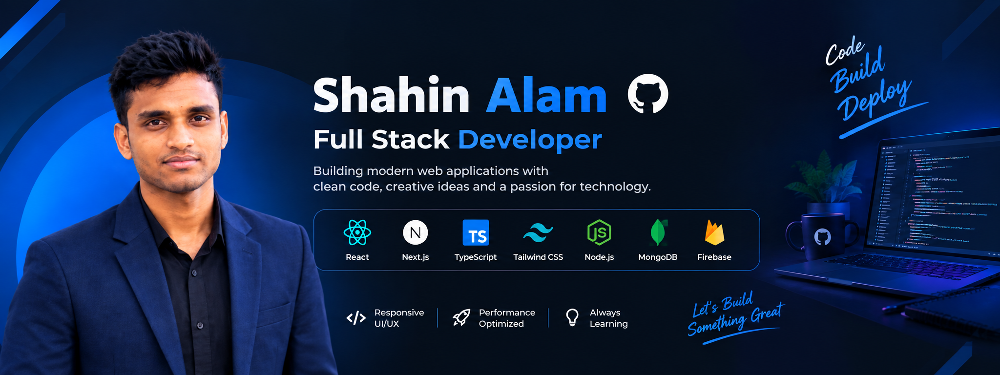

<!-- ========================================================= -->
<!--                         BANNER                            -->
<!-- ========================================================= -->

  

 

<!-- ========================================================= -->
<!--                         INTRO                             -->
<!-- ========================================================= -->

<h1 align="center">
  Hi 👋, I'm Shahin Alam
</h1>

  

  

---

<!-- ========================================================= -->
<!--                       ABOUT ME                            -->
<!-- ========================================================= -->

## 👨‍💻 About Me

I'm **Shahin Alam**, a passionate Web Developer focused on building
modern, responsive, and user-friendly web applications.

- 🚀 Currently learning **Next.js**
- ⚛️ Working with **React & TypeScript**
- 💻 Strong interest in **JavaScript & Full Stack Development**
- 🎨 Passionate about modern and responsive UI/UX
- 🔥 Building real-world projects to improve my skills
- 📚 Continuously learning new technologies
- 🎯 Goal: Become a professional **Full Stack Developer**

---

<!-- ========================================================= -->
<!--                    TECHNOLOGIES                          -->
<!-- ========================================================= -->

## 🛠️ Technologies & Tools

### 💻 Languages

  

### ⚛️ Frontend

  

### 🔧 Backend & Database

  

### 🧰 Tools

  

---

<!-- ========================================================= -->
<!--                     GITHUB STREAK                        -->
<!-- ========================================================= -->

## 🔥 GitHub Streak

  

---

<!-- ========================================================= -->
<!--                  FEATURED PROJECTS                       -->
<!-- ========================================================= -->

## 🚀 Featured Projects

  

  

---

<!-- ========================================================= -->
<!--                    CONNECT WITH ME                       -->
<!-- ========================================================= -->

## 📫 Connect With Me

  

  

---

<!-- ========================================================= -->
<!--                         FOOTER                            -->
<!-- ========================================================= -->

  <b>💻 Code • Learn • Build • Improve 🚀</b>

  ⭐ Thanks for visiting my profile!

